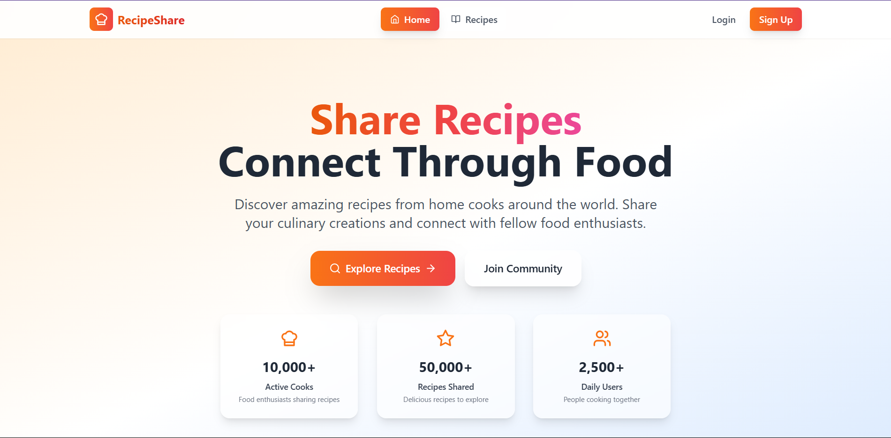
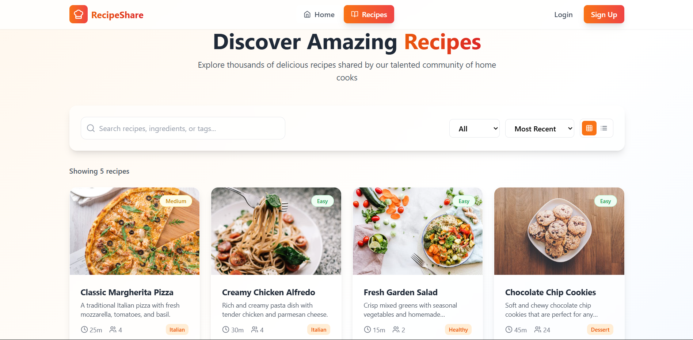

# 🍲 Recipe Sharing Platform

## 📸 Screenshots

### 🏠 Home Page



### ➕ Discover Recipe



A modern web application built with **React**, **TypeScript**, and **Vite** that allows users to view, add, and share recipes.

---

## 🚀 Features

- 🧾 View a list of delicious recipes
- 🔍 View full details for each recipe
- ➕ Add your own recipes
- 🧠 Responsive and user-friendly design
- ⚙️ Built with Vite, React, and TypeScript

---

## 🧰 Tech Stack

- [React](https://reactjs.org/)
- [Vite](https://vitejs.dev/)
- [TypeScript](https://www.typescriptlang.org/)
- [Axios](https://axios-http.com/) for HTTP requests
- [React Router](https://reactrouter.com/) for navigation

---

## 📦 Installation

```bash
git clone https://github.com/aravindhsamy/recipe-sharing-platform.git
cd recipe-sharing-platform
npm install
npm run dev

---
src/
├── components/    # Reusable components
├── pages/         # Home, RecipeList, AddRecipe, etc.
├── contexts/      # React Context (Auth, Recipes)
├── App.tsx        # Main app and routes
└── main.tsx       # Entry point
